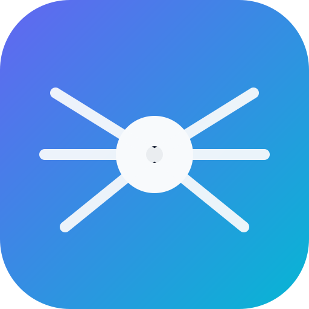

<div align="center">
  
  <h1>LiDAR Research Atlas</h1>
  <p><strong>Indoor and outdoor 2D/3D LiDAR datasets, point-cloud methods, SLAM, perception benchmarks, ecosystem tools, and lawful access guides.</strong></p>
  <p>
    <a href="https://github.com/das-swagat/lidar-research-atlas/actions/workflows/validate.yml"></a>
    <a href="https://github.com/das-swagat/lidar-research-atlas/releases"></a>
    <a href="LICENSE"></a>
    <a href="LICENSE-CONTENT.md"></a>
    <a href="CITATION.cff"></a>
  </p>
</div>


LiDAR Research Atlas is a curated, provenance-tracked research index for **indoor and outdoor 2D and 3D LiDAR**. It connects researchers and developers with LiDAR datasets, point-cloud methods, SLAM and odometry algorithms, autonomous-driving and robotics benchmarks, semantic segmentation, 3D object detection, self-supervised learning, remote sensing, mobile mapping, aerial LiDAR, simulators, libraries, and geospatial resources.

Use the atlas to find authoritative project pages, official implementations, lawful download routes, access requirements, licensing conditions, recommended citations, and reproducibility notes. The atlas links to original providers; it does not mirror or redistribute third-party datasets, annotations, source code, model weights, or restricted files.

[**Browse the live atlas**](https://das-swagat.github.io/lidar-research-atlas/) · [Datasets](https://das-swagat.github.io/lidar-research-atlas/catalog/datasets/) · [Methods](https://das-swagat.github.io/lidar-research-atlas/catalog/methods/) · [Ecosystem](https://das-swagat.github.io/lidar-research-atlas/catalog/ecosystem/) · [Contribute](CONTRIBUTING.md)


## Purpose

LiDAR research is fragmented across provider portals, benchmark sites, papers, repositories, cloud buckets, and institution-specific agreements. This atlas organizes those sources into a provenance-tracked scholarly catalog while preserving the authorship, licenses, and access controls of the original contributors.

The project **links; it does not redistribute**. Each record identifies authoritative sources, original contributors, sensor/domain scope, legal access route, commercial-use and redistribution status, required citations, implementation relationship, and verification date.

## Coverage

| Dimension | Included examples |
|---|---|
| Geometry | 2D planar laser scans; 3D mobile, terrestrial, airborne, and automotive point clouds |
| Environments | Indoor, outdoor, urban, road, campus, off-road, aerial, industrial-adjacent |
| Tasks | SLAM, odometry, mapping, localization, registration, segmentation, detection, tracking, self-supervised learning |
| Resource types | 85 datasets, 53 methods, 69 ecosystem resources, benchmark portals, access guides, CSV exports, and JSON |

Adjacent RGB-D or photogrammetric resources are included only where they are widely used in transferable 3D learning, and are explicitly labeled as non-LiDAR.

## Explore the atlas

- **Live documentation:** [LiDAR Research Atlas](https://das-swagat.github.io/lidar-research-atlas/)
- **Dataset catalog:** [catalog/datasets/](catalog/datasets/)
- **Method catalog:** [catalog/methods/](catalog/methods/)
- **LiDAR ecosystem:** [catalog/ecosystem/](catalog/ecosystem/)
- **Lawful download workflow:** [download and access guide](docs/guides/lawful-download-workflow.md)
- **Provenance policy:** [source and verification requirements](policies/PROVENANCE_POLICY.md)
- **Corrections and takedowns:** [correction and rights-holder process](policies/CORRECTIONS_AND_TAKEDOWNS.md)
- **How to contribute:** [CONTRIBUTING.md](CONTRIBUTING.md)

## Citation principle

Researchers must cite the **original dataset and method publications** used in their work. Cite this atlas additionally only when its taxonomy, metadata, access guide, software, or analysis materially supported the work. See `CITATION.cff` and `docs/guides/citation.md`.

## Use, fork, and contribute

- **Browse:** Use the [live atlas](https://das-swagat.github.io/lidar-research-atlas/) to explore datasets, methods, ecosystem resources, access requirements, and citation guidance.
- **Clone or fork:** Reuse the original atlas software and metadata under their stated licenses; third-party resources remain governed by provider terms.
- **Contribute:** Open an issue or pull request for a verified dataset, method, correction, broken link, or documentation improvement.
- **Cite responsibly:** Cite the original dataset and method authors, and cite this atlas only when its curation, taxonomy, metadata, software, or analysis materially supported the work.

See [CONTRIBUTING.md](CONTRIBUTING.md), [CITATION.cff](CITATION.cff), and the [provenance policy](policies/PROVENANCE_POLICY.md).

## What this adds beyond link lists

- Searchable and generated documentation rather than one long README.
- Machine-readable YAML, CSV, and JSON.
- Separate verified, partial, and discovery-only layers.
- Dataset access, agreement, commercial-use, redistribution, and citation fields.
- Explicit distinction between official, author-maintained, framework, and community implementations.
- Source provenance, correction/takedown policy, restricted-file scanning, and automated validation.
- A wider ecosystem catalog covering manufacturers, libraries, frameworks, simulators, tools, and related collections.

The v0.2.0 expansion was informed by [Awesome 3D LiDAR Datasets](https://github.com/minwoo0611/Awesome-3D-LiDAR-Datasets) and [Awesome LIDAR](https://github.com/szenergy/awesome-lidar). The atlas does not copy their abstracts, prose, figures, or table presentation; it uses factual resource leads and official outbound links to create independently written, provenance-marked records. See the [source-list comparison](docs/about/source-comparison.md).

## Local preview

```bash
python -m venv .venv
source .venv/bin/activate
python -m pip install -r requirements-dev.txt
python scripts/validate_catalog.py
python scripts/build_catalog.py
mkdocs serve
```

## Project status

Version **0.2.2** improves full-width catalog-table presentation while retaining **207 structured records**: 85 datasets, 53 methods, and 69 ecosystem resources. Records marked `discovery_only`, `source_listed`, or `partial` are retained transparently and must not be interpreted as fully verified license or access determinations.

## Licensing

Original software is Apache-2.0. Original documentation and curated metadata are CC BY 4.0. Third-party resources remain under their respective owners' terms. See `LICENSE`, `LICENSE-CONTENT.md`, `THIRD_PARTY_NOTICES.md`, and `DISCLAIMER.md`.
