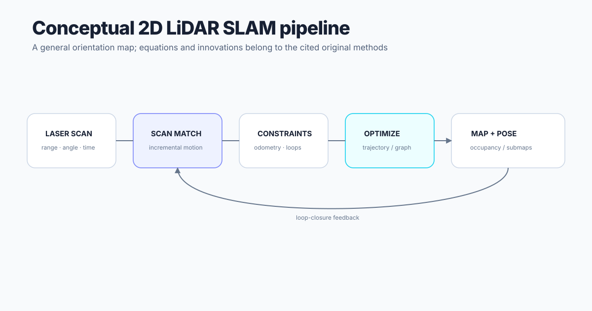

# 2D LiDAR SLAM

A planar SLAM system typically converts timestamped range-angle measurements into scan features or occupancy evidence, estimates incremental motion through scan matching and/or odometry, accumulates constraints, detects loop closures, and optimizes a trajectory/map representation.

Method families in the catalog include particle-filter mapping, high-rate scan matching, and submap/pose-graph systems. Exact assumptions and equations remain attributable to the original papers.
