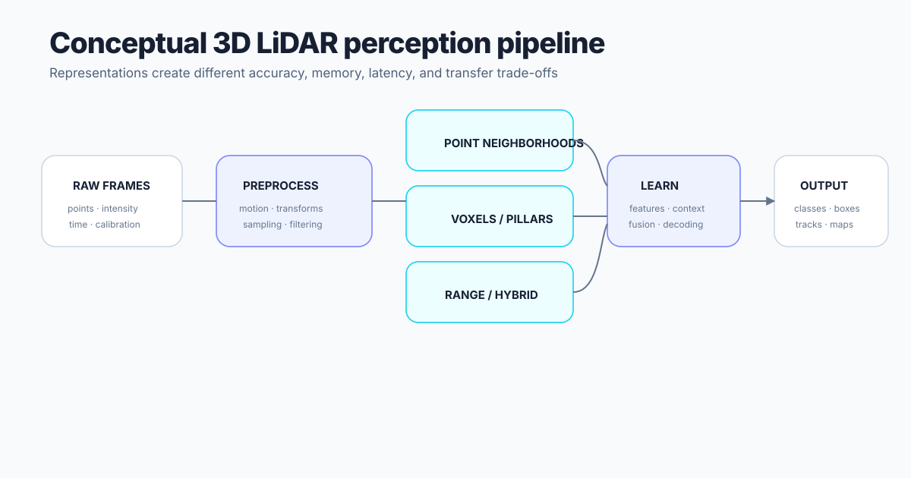

# 3D LiDAR perception

LiDAR perception pipelines commonly validate sensor frames, compensate motion, transform coordinates, represent points as raw neighborhoods, voxels, pillars, range images, or hybrids, learn features, predict task outputs, and evaluate with dataset-specific protocols.

Representation changes alter quantization, neighborhood structure, memory, latency, and domain-transfer behavior. Benchmark values are comparable only when splits, label maps, preprocessing, and metrics align.
