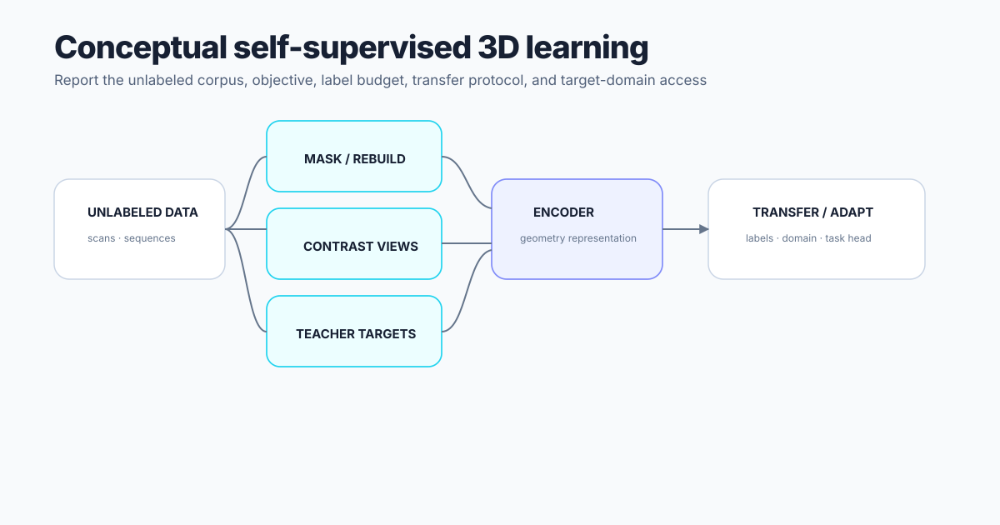

# Self-supervised 3D learning

Self-supervised LiDAR and point-cloud methods learn from unlabeled geometry through objectives such as contrastive agreement, masked reconstruction, point-token prediction, temporal consistency, occupancy, or teacher–student targets. A defensible survey records the pretraining corpus, label budget, transfer protocol, target-domain access, and whether pretraining guidance is retained during adaptation.
