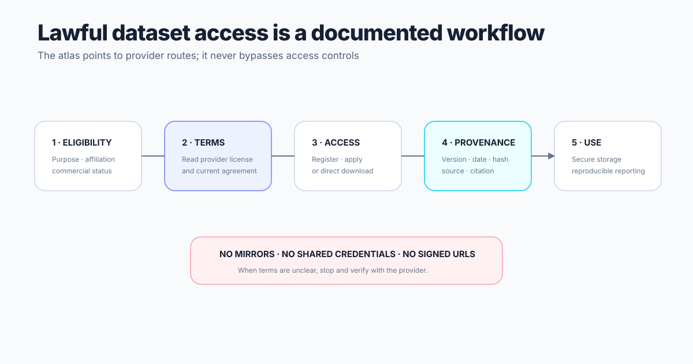

# Lawful download workflow

## 1. Confirm identity and eligibility
Determine whether access is direct, registered, agreement-based, application-reviewed, non-commercial, sample-only, or paid.

## 2. Read authoritative terms
Open the provider's current terms and save the version/date accepted. Do not rely only on this atlas, a blog, or a mirror.

## 3. Use the provider's procedure
Create the required account, verify an institutional email, submit an agreement, or request approval. Never bypass gates or reuse another person's credentials.

## 4. Download only authorized components
Use official links, development kits, command-line tools, or cloud paths published by the provider. Do not use reverse-engineered signed URLs or unauthorized mirrors.

## 5. Preserve provenance
Record the official URL, version, subset, retrieval date, checksum when available, license/terms version, and required citations.

## 6. Separate licenses
Dataset files, labels, code, weights, maps, and documentation may have different terms. Review each separately.

## 7. Store securely
Respect privacy, geographic, institutional, and access-control obligations. Do not commit data or credentials to Git.

## 8. Publish responsibly
Share code, manifests, checksums, and preprocessing instructions when permitted. Do not redistribute restricted source data or derived artifacts that reconstruct it.
