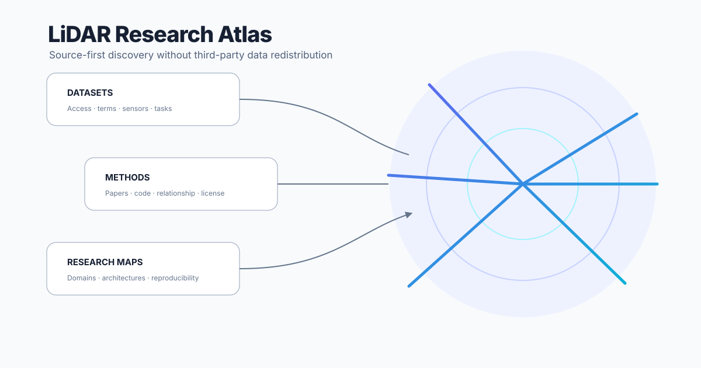
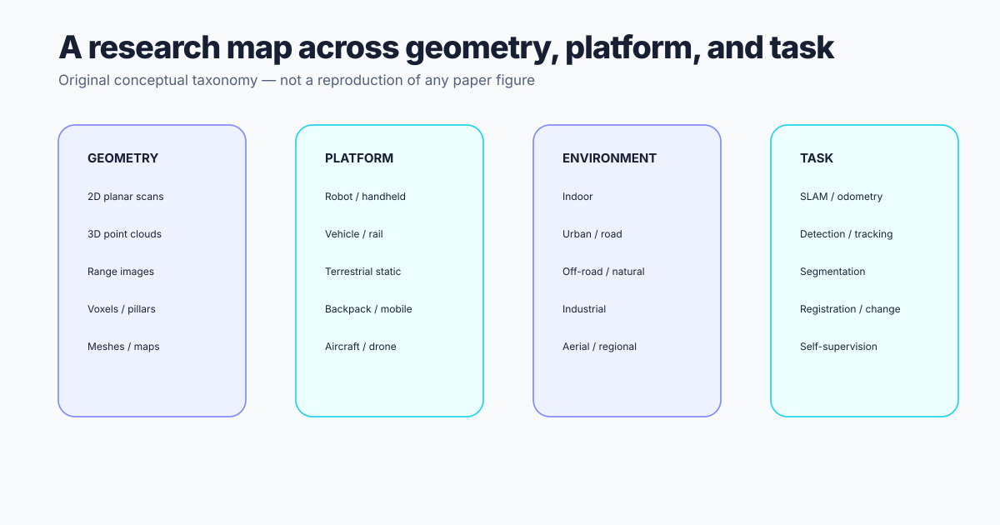

  

    SCHOLARLY DISCOVERY · PROVENANCE · LAWFUL ACCESS
    <h1>LiDAR research, mapped with evidence.</h1>
    
A curated atlas of indoor and outdoor 2D/3D datasets, methods, benchmarks, and official access routes—without redistributing third-party data.

    

      <a class="md-button md-button--primary" href="catalog/datasets/">Explore datasets</a>
      <a class="md-button" href="catalog/methods/">Explore methods</a>
    

  

  

  
<strong>2D + 3D</strong>Planar scans, mobile mapping, terrestrial, automotive, and airborne point clouds.

  
<strong>Indoor + outdoor</strong>Robotics, autonomy, geospatial, infrastructure, and transferable 3D research.

  
<strong>Source-first</strong>Every record points to original contributors, papers, repositories, terms, and citation guidance.

  
<strong>No data mirroring</strong>Official access routes only. Provider agreements and current terms control.

## Why this exists

A useful dataset list must answer more than “where is the file?” It should explain what the resource measures, which tasks it supports, how access is granted, what can be redistributed, which implementation is official, and who must be cited.

## Scholarly boundary

The atlas contributes curation, taxonomy, provenance verification, access guidance, comparative analysis, and original explanatory diagrams. It does not claim authorship of indexed datasets or methods.

!!! warning "Provider terms control"
    Access labels are practical summaries, not legal advice. Recheck the authoritative provider page before downloading, publishing derivatives, or using a resource commercially.
